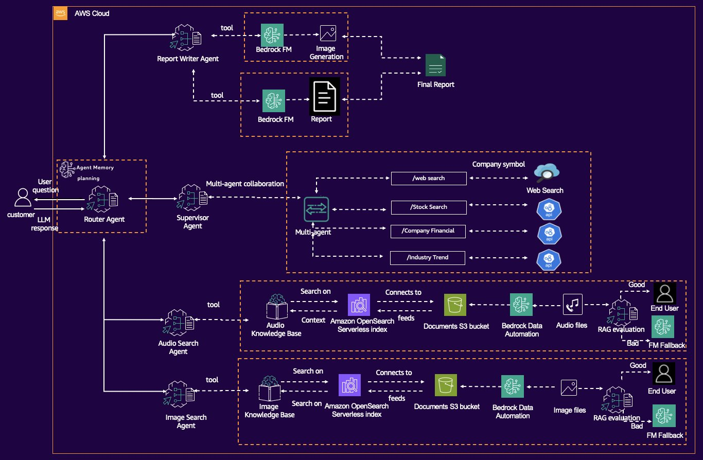

# BLOG TRANSLATION

# Xây dựng trợ lý AI đa phương thức với Amazon Nova và Amazon Bedrock Data Automation

> 📖 Bài viết gốc: Build an agentic multimodal AI assistant with Amazon Nova and Amazon Bedrock Data Automation
> 
> 
> **👤 Tác giả**: Julia Hu, Jessie-Lee Fry, Rui Cardoso
> 
> **📅 Ngày xuất bản**: 23/06/2025
> 
> **🌐 Nguồn**: AWS Artificial Intelligence Blog
> 
> **👨‍💻 Người dịch**: [Hồ Minh Trung] - FCJ Train
> 
> **📅 Ngày dịch**: 09/07/2025
> 
> **⏱️ Thời gian đọc**: 15 phút
> 

---

## 📋 Tóm tắt

**🎯 Đối tượng đọc**: Nhà phát triển AI/ML, kiến trúc sư doanh nghiệp, kỹ sư DevOps

**📊 Độ khó**: Intermediate

**🏷️ Tags**: Generative AI

---

## 📚 Mục lục

- [Phần 1: Giới thiệu](about:blank#ph%E1%BA%A7n-1-gi%E1%BB%9Bi-thi%E1%BB%87u)
- [Phần 2: Tổng quan về quy trình Agentic](about:blank#ph%E1%BA%A7n-2-t%E1%BB%95ng-quan-v%E1%BB%81-quy-tr%C3%ACnh-agentic)
- [Phần 3: Tổng quan giải pháp](about:blank#ph%E1%BA%A7n-3-t%E1%BB%95ng-quan-gi%E1%BA%A3i-ph%C3%A1p)
- [Phần 4: Ví dụ về luồng công việc hợp tác đa công cụ](about:blank#ph%E1%BA%A7n-4-v%C3%AD-d%E1%BB%A5-v%E1%BB%81-quy-tr%C3%ACnh-multi-tool-collaboration)
- [Phần 5: Lợi ích của việc sử dụng Amazon Bedrock cho luồng công việc agentic AI tạo sinh có khả năng mở rộng](about:blank#ph%E1%BA%A7n-5-l%E1%BB%A3i-%C3%ADch-c%E1%BB%A7a-amazon-bedrock)
- [Phần 6: Các cân nhắc và tùy chỉnh](about:blank#ph%E1%BA%A7n-6-c%C3%A1c-c%C3%A2n-nh%E1%BA%AFc-v%C3%A0-t%C3%B9y-ch%E1%BB%89nh)
- [Phần 7: Ứng dụng trong các ngành](about:blank#ph%E1%BA%A7n-7-%E1%BB%A9ng-d%E1%BB%A5ng-trong-c%C3%A1c-ng%C3%A0nh)
- [Kết luận](about:blank#k%E1%BA%BFt-lu%E1%BA%ADn)
- [Glossary - Thuật ngữ](about:blank#glossary---thu%E1%BA%ADt-ng%E1%BB%AF)
- [Tài liệu tham khảo](about:blank#t%C3%A0i-li%E1%BB%87u-tham-kh%E1%BA%A3o)

---

## Phần 1: Giới thiệu

Các doanh nghiệp hiện đại sở hữu lượng dữ liệu phong phú, bao gồm nhiều phương thức khác nhau – từ tài liệu văn bản, tệp PDF đến các slide thuyết trình, hình ảnh, bản ghi âm thanh, và hơn thế nữa. Hãy tưởng tượng bạn hỏi một trợ lý AI về cuộc gọi báo cáo thu nhập hàng quý của công ty: trợ lý không chỉ đọc bản ghi (transcript) mà còn phải “nhìn” các biểu đồ trong slide thuyết trình và “nghe” phát biểu của CEO. Gartner dự đoán rằng đến năm 2027, [40% các giải pháp Gen AI](https://www.gartner.com/en/newsroom/press-releases/2024-09-09-gartner-predicts-40-percent-of-generative-ai-solutions-will-be-multimodal-by-2027) sẽ là đa phương thức (văn bản, hình ảnh, âm thanh, video), tăng từ chỉ 1% vào năm 2023. Sự chuyển đổi này nhấn mạnh tầm quan trọng ngày càng tăng của khả năng hiểu đa phương thức trong các ứng dụng kinh doanh. Để đạt được điều này, cần có một trợ lý AI tạo sinh đa phương thức – một trợ lý có thể hiểu và kết hợp văn bản, hình ảnh, và các loại dữ liệu khác. Đồng thời, cần một kiến trúc agentic để trợ lý AI có thể chủ động thu thập thông tin, lập kế hoạch công việc, và đưa ra quyết định về việc sử dụng công cụ (tool calling), thay vì chỉ phản hồi thụ động theo các lệnh (prompt).

Trong bài viết này, chúng tôi khám phá một giải pháp đáp ứng chính xác nhu cầu đó – sử dụng [Amazon Nova Pro](https://aws.amazon.com/ai/generative-ai/nova/), một mô hình ngôn ngữ lớn đa phương thức (multimodal large language model - LLM) từ AWS, làm trung tâm điều phối, kết hợp với các tính năng mới mạnh mẽ của [Amazon Bedrock](https://aws.amazon.com/bedrock/), như [Amazon Bedrock Data Automation](https://aws.amazon.com/bedrock/bda/) để xử lý dữ liệu đa phương thức. Chúng tôi trình bày cách các mô hình luồng công việc agentic, chẳng hạn như [Retrieval Augmented Generation](https://aws.amazon.com/what-is/retrieval-augmented-generation/) (RAG), [điều phối đa công cụ](https://docs.aws.amazon.com/bedrock/latest/userguide/agents-multi-agent-collaboration.html) (multi-tool orchestration) và định tuyến có điều kiện (conditional routing) với [LangGraph](https://www.langchain.com/langgraph), cho phép tạo ra các giải pháp toàn diện mà các nhà phát triển trí tuệ nhân tạo và học máy (AI/ML) cũng như các kiến trúc sư doanh nghiệp có thể áp dụng và mở rộng. Chúng tôi sẽ đi qua một ví dụ về một trợ lý AI quản lý tài chính có thể cung cấp nghiên cứu định lượng và tư vấn tài chính dựa trên cơ sở bằng cách phân tích cả cuộc gọi báo cáo thu nhập (âm thanh) và các slide thuyết trình (hình ảnh), cùng với các nguồn dữ liệu tài chính liên quan. Chúng tôi cũng nhấn mạnh cách bạn có thể áp dụng mô hình này trong các ngành như tài chính, y tế, và sản xuất.

---

## Phần 2: Tổng quan về quy trình Agentic

Cốt lõi của mô hình agentic bao gồm các giai đoạn sau:

- **Lý luận (Reason)** – Agent (thường là một LLM) xem xét yêu cầu của người dùng và bối cảnh hoặc trạng thái hiện tại. Nó quyết định bước tiếp theo là gì – có thể là cung cấp câu trả lời trực tiếp hoặc gọi một công cụ hay tác vụ phụ để thu thập thêm thông tin.
- **Hành động (Act)** – Agent thực hiện bước đó. Điều này có thể là gọi một công cụ hoặc hàm, chẳng hạn như truy vấn tìm kiếm, tra cứu cơ sở dữ liệu, hoặc phân tích tài liệu bằng Amazon Bedrock Data Automation.
- **Quan sát (Observe)** – Agent quan sát kết quả của hành động. Ví dụ, nó đọc văn bản hoặc dữ liệu được trả về từ công cụ.
1. **Lặp lại (Loop)** – Với thông tin mới, agent tiếp tục lý luận, quyết định xem nhiệm vụ đã hoàn thành hay cần thêm một bước nữa. Vòng lặp này tiếp tục cho đến khi agent xác định có thể đưa ra câu trả lời cuối cùng cho người dùng.

Quy trình ra quyết định lặp lại này cho phép agent xử lý các yêu cầu phức tạp mà không thể hoàn thành chỉ với một lệnh duy nhất. Tuy nhiên, việc triển khai các hệ thống agentic có thể gặp thách thức. Chúng làm tăng độ phức tạp trong luồng điều khiển, và các agent đơn giản có thể kém hiệu quả (gọi quá nhiều công cụ hoặc lặp lại không cần thiết) hoặc khó quản lý khi mở rộng quy mô. Đây là lúc các khung công tác có cấu trúc như LangGraph phát huy tác dụng. LangGraph cho phép định nghĩa một đồ thị có hướng (directed graph) hoặc máy trạng thái (state machine) của các hành động tiềm năng với các node được xác định rõ ràng (các hành động như “Report Writer” hoặc “Query Knowledge Base”) và các cạnh (các chuyển tiếp được phép). Mặc dù lý luận nội bộ của agent vẫn quyết định con đường nào sẽ đi,LangGraph đảm bảo quy trình vẫn dễ quản lý và minh bạch. Sự linh hoạt được kiểm soát này mang lại cho trợ lý đủ quyền tự chủ để xử lý các nhiệm vụ đa dạng, đồng thời đảm bảo luồng công việc tổng thể ổn định và có thể dự đoán.

---

## Phần 3: Tổng quan giải pháp

Giải pháp này là một trợ lý AI quản lý tài chính được thiết kế để hỗ trợ các nhà phân tích truy vấn danh mục đầu tư, phân tích công ty và tạo báo cáo. Trung tâm của giải pháp là Amazon Nova, một mô hình ngôn ngữ lớn (LLM) hoạt động như một bộ xử lý thông minh cho việc suy luận (inference). Amazon Nova xử lý văn bản, hình ảnh hoặc tài liệu (như slide báo cáo thu nhập) và tự động quyết định công cụ nào sẽ sử dụng để đáp ứng yêu cầu. Amazon Nova được tối ưu hóa cho các tác vụ doanh nghiệp và hỗ trợ [gọi hàm](https://docs.aws.amazon.com/nova/latest/userguide/tool-use.html), giúp mô hình lập kế hoạch hành động và gọi công cụ một cách có cấu trúc. Với [cửa sổ ngữ cảnh lớn](https://docs.aws.amazon.com/nova/latest/userguide/what-is-nova.html) (lên đến 300,000 token trong Amazon Nova Lite và Amazon Nova Pro), nó có thể quản lý các tài liệu dài hoặc lịch sử hội thoại khi suy luận.

Luồng công việc bao gồm các thành phần chính sau:

- **Truy xuất cơ sở tri thức (Knowledge base retrieval)** – Cả tệp âm thanh cuộc gọi báo cáo thu nhập và tệp PowerPoint đều được xử lý bởi Amazon Bedrock Data Automation, một dịch vụ được quản lý giúp trích xuất văn bản, phiên âm (transcribe) âm thanh và video, đồng thời chuẩn bị dữ liệu cho phân tích. Nếu người dùng tải lên tệp PowerPoint, hệ thống sẽ chuyển đổi mỗi slide thành hình ảnh (PNG) để tìm kiếm và phân tích hiệu quả, một kỹ thuật lấy cảm hứng từ các ứng dụng AI tạo sinh như [Manus](https://manus.im/). Amazon Bedrock Data Automation thực chất là một pipeline AI đa phương thức sẵn có. Trong kiến trúc của chúng tôi, Amazon Bedrock Data Automation đóng vai trò như một cầu nối giữa dữ liệu thô và luồng công việc agentic. Sau đó, [Amazon Bedrock Knowledge Bases](https://aws.amazon.com/bedrock/knowledge-bases/) chuyển đổi các đoạn dữ liệu được trích xuất từ Amazon Bedrock Data Automation thành các vector embeddings bằng [Amazon Titan Text Embeddings V2](https://docs.aws.amazon.com/bedrock/latest/userguide/titan-embedding-models.html), và lưu trữ các vector này trong cơ sở dữ liệu [Amazon OpenSearch Serverless](https://aws.amazon.com/opensearch-service/features/serverless/).
- **Agent định tuyến (Router agent)** – Khi người dùng đặt câu hỏi, ví dụ: “Tóm tắt các rủi ro chính trong báo cáo thu nhập quý 3”, Amazon Nova trước tiên xác định liệu nhiệm vụ có yêu cầu truy xuất dữ liệu, xử lý tệp hay tạo phản hồi hay không. Nó duy trì bộ nhớ của cuộc đối thoại, diễn giải yêu cầu của người dùng và lập kế hoạch cho các hành động cần thực hiện. Mô-đun “Memory & Planning” trong sơ đồ giải pháp cho thấy agent định tuyến có thể sử dụng lịch sử hội thoại và kỹ thuật gợi ý theo chuỗi suy nghĩ (chain-of-thought - CoT) để xác định các bước tiếp theo. Quan trọng hơn, agent định tuyến xác định liệu câu hỏi có thể được trả lời bằng dữ liệu nội bộ của công ty hay cần thông tin và công cụ bên ngoài.
- **Agent RAG đa phương thức (Multimodal RAG agent)** – Đối với các câu hỏi liên quan đến thông tin âm thanh và video, Amazon Bedrock Data Automation sử dụng một lệnh gọi API thống nhất để trích xuất thông tin chi tiết từ dữ liệu đa phương tiện này và lưu trữ thông tin trích xuất trong Amazon Bedrock Knowledge Bases. Amazon Nova sử dụng Amazon Bedrock Knowledge Bases để truy xuất câu trả lời dựa trên sự thật thông qua tìm kiếm ngữ nghĩa (semantic search). Điều này đảm bảo các phản hồi được dựa trên dữ liệu thực, giảm thiểu hiện tượng ảo giác (hallucination). Nếu Amazon Nova tạo ra một câu trả lời, một bước kiểm tra ảo giác thứ cấp sẽ so sánh câu trả lời với các nguồn đáng tin cậy để phát hiện các tuyên bố không được hỗ trợ.
- **Kiểm tra ảo giác (Hallucination check - quality gate)** – Để đảm bảo độ tin cậy, luồng công việc có thể bao gồm một bước xử lý sau (postprocessing) sử dụng một mô hình nền tảng (foundation model - FM) khác ngoài gia đình Amazon Nova, chẳng hạn như Claude của Anthropic, Mistral, hoặc Llama của Meta, để đánh giá độ trung thực của câu trả lời. Ví dụ, sau khi Amazon Nova tạo ra một câu trả lời, một mô hình hoặc hàm phát hiện ảo giác có thể so sánh câu trả lời với các nguồn được truy xuất hoặc dữ kiện đã biết. Nếu phát hiện ảo giác tiềm ẩn (câu trả lời không được hỗ trợ bởi dữ liệu tham chiếu), agent có thể chọn thực hiện thêm truy xuất, điều chỉnh câu trả lời hoặc chuyển giao cho con người.
- **Hợp tác đa công cụ (Multi-tool collaboration)** – Sự hợp tác đa công cụ này cho phép AI không chỉ tìm kiếm thông tin mà còn thực hiện các hành động trước khi đưa ra câu trả lời cuối cùng. Điều này giới thiệu các tùy chọn đa công cụ. Agent giám sát (supervisor agent) có thể tạo hoặc phối hợp nhiều agent chuyên biệt cho từng công cụ (ví dụ, một agent tìm kiếm web để thực hiện tìm kiếm chung, một agent tìm kiếm cổ phiếu để lấy dữ liệu thị trường, hoặc các agent chuyên biệt khác cho các số liệu tài chính của công ty hoặc tin tức ngành). Mỗi agent thực hiện một nhiệm vụ cụ thể (có thể gọi API hoặc thực hiện truy vấn trên internet) và trả kết quả về cho agent giám sát. Amazon Nova Pro sở hữu khả năng suy luận mạnh mẽ, cho phép agent giám sát kết hợp các kết quả này. Cách tiếp cận đa agent này tuân theo nguyên tắc phân chia các nhiệm vụ phức tạp giữa các agent chuyên biệt, cải thiện hiệu quả và độ tin cậy cho các câu hỏi phức tạp.
- **Agent tạo báo cáo (Report creation agent)** – Một khía cạnh đáng chú ý trong kiến trúc là việc sử dụng Amazon Nova Canvas để tạo đầu ra. Amazon Nova Canvas là một mô hình tạo hình ảnh chuyên biệt trong gia đình Amazon Nova, nhưng trong bối cảnh này, chúng tôi sử dụng khái niệm “canvas” theo nghĩa ẩn dụ để chỉ một mẫu hoặc định dạng đầu ra nội dung có cấu trúc. Ví dụ, chúng tôi có thể định nghĩa một mẫu cho “báo cáo nhà đầu tư” mà trợ lý sẽ điền vào: Phần 1: Điểm nổi bật chính (danh sách gạch đầu dòng), Phần 2: Tóm tắt tài chính (bảng số liệu), Phần 3: Trích dẫn đáng chú ý, v.v. Agent có thể hướng dẫn Amazon Nova điền vào mẫu này bằng cách cung cấp một lệnh hệ thống (system prompt) chứa định dạng mong muốn (tương tự như gợi ý vài lần - few-shot prompting, trong đó cung cấp bố cục). Kết quả là trợ lý không chỉ trả lời các câu hỏi tức thời mà còn có thể tạo ra các báo cáo toàn diện trông như được chuẩn bị bởi một nhà phân tích con người, kết hợp văn bản, hình ảnh và tham chiếu đến hình ảnh.

Các thành phần này được điều phối trong một luồng công việc agentic. Thay vì một kịch bản cố định, giải pháp sử dụng một đồ thị quyết định động (dynamic decision graph) được triển khai với thư viện mã nguồn mở **LangGraph** trong giải pháp notebook để định tuyến giữa các bước. Kết quả là một trợ lý cảm giác ít giống một chatbot và giống hơn một nhà phân tích hợp tác – một trợ lý có thể phân tích bản ghi âm cuộc gọi báo cáo thu nhập, phê bình bộ slide hoặc soạn thảo bản ghi nhớ nhà đầu tư với sự can thiệp tối thiểu từ con người.

Sơ đồ sau đây cho thấy kiến trúc cấp cao của luồng công việc AI agentic.

**Amazon Nova**

điều phối các công cụ khác nhau – bao gồm

**Amazon Bedrock Data Automation**

để xử lý tài liệu và hình ảnh, và cơ sở tri thức để truy xuất – nhằm đáp ứng các yêu cầu phức tạp của người dùng. Để ngắn gọn, chúng tôi không liệt kê toàn bộ mã tại đây;

[GitHub repo](https://github.com/aws-samples/amazon-nova-samples/tree/main/multimodal-understanding/repeatable-patterns/16-multimodal-agentic-workflow)

bao gồm một ví dụ hoạt động đầy đủ. Các nhà phát triển có thể chạy ví dụ đó để xem agent hoạt động và mở rộng nó với dữ liệu của riêng họ.



—

## Phần 4: Ví dụ về luồng công việc hợp tác đa công cụ

Để minh họa luồng công việc của agent hợp tác đa công cụ, chúng tôi sẽ khám phá một ví dụ về cách một tương tác hỏi-đáp có thể diễn ra trong hệ thống đã triển khai cho việc hợp tác đa công cụ:

- **Lệnh của người dùng** – Trong giao diện trò chuyện (chat UI), người dùng cuối đặt một câu hỏi, chẳng hạn như: “Hiệu suất cổ phiếu của XXX trong năm nay như thế nào, và nó so sánh ra sao với các công ty cùng ngành rideshare?”
- **Phản hồi ban đầu của agent** – Agent (bộ điều phối **Amazon Nova FM**) nhận câu hỏi và phản hồi với:
Received your question. Routing to the reasoning engine…
>
- **Lập kế hoạch và lựa chọn công cụ** – Agent xác định rằng nó cần các thông tin sau:
    - Mã chứng khoán (ticker symbol) của công ty (XXX)
    - Giá cổ phiếu theo thời gian thực và biến động từ đầu năm (YTD)
    - Các chỉ số tài chính chính (doanh thu, thu nhập ròng, tỷ lệ giá trên thu nhập - price-earnings ratio)
    - Các điểm chuẩn ngành (hiệu suất YTD của các công ty cùng ngành, mức tăng trưởng doanh thu trung bình)
- **Thực thi kế hoạch bằng cách gọi công cụ** – Agent gọi các công cụ để thực hiện các hành động sau:
    - **Tra cứu mã chứng khoán**:
    Agent → WebSearchTool.lookupTicker(“XXX Inc”)
    WebSearchTool → Agent: returns “XXX”
    - **Lấy dữ liệu hiệu suất cổ phiếu theo thời gian thực bằng mã chứng khoán đã truy xuất**:
    
    ```
    Agent → StockAnalysisTool.getPerformance(
    symbol=“XXX”,
    period=“YTD”
    )
    StockAnalysisTool → Agent:
    {
    currentPrice:
    ytdChange:
    52wkRange:
    volume:
    }
    ```
    
    - **Truy xuất các chỉ số tài chính của công ty bằng mã chứng khoán đã truy xuất**:
    
    ```
    Agent → CompanyFinancialAnalysisTool.getMetrics(“UBER”)
    CompanyFinancialAnalysisTool → Agent:
    {
    revenueQ4_2024: xxx B,
    netIncomeQ4_2024: xxx M,
    peRatio: xxx
    }
    ```
    
    - **Thu thập dữ liệu điểm chuẩn ngành bằng mã chứng khoán đã truy xuất**
    
    ```
    Agent → IndustryAnalysisTool.comparePeers(
    symbol=“XXX”,
    sector=“Rideshare”
    )
    IndustryAnalysisTool → Agent:
    {
    avgPeerYTD:
    avgRevenueGrowth:
    }
    ```
    
    **Vòng lặp xác thực** – Agent thực hiện một vòng lặp xác thực:
    
    ```
      Agent: validate()
      ↳ Are all four data points present?
      • Ticker :heavy_check_mark:
      • Stock performance :heavy_check_mark:
      • Financial metrics :heavy_check_mark:
      • Industry benchmark :heavy_check_mark:
      ↳ All set—no retry needed.
    ```
    
- Nếu thiếu bất kỳ dữ liệu nào hoặc công cụ gặp lỗi, bộ điều phối FM sẽ kích hoạt trình xử lý lỗi (thử lại tối đa ba lần), sau đó tiếp tục kế hoạch tại bước bị lỗi.

**Tổng hợp và câu trả lời cuối cùng** – Agent sử dụng Amazon Nova Pro để tổng hợp các điểm dữ liệu và tạo ra câu trả lời cuối cùng dựa trên các điểm dữ liệu này.

Hình dưới đây cho thấy sơ đồ luồng của agent hợp tác đa công cụ này.


—

## Phần 5: Lợi ích của việc sử dụng Amazon Bedrock cho luồng công việc agentic AI tạo sinh có khả năng mở rộng

Giải pháp này được xây dựng trên Amazon Bedrock bởi vì AWS cung cấp một hệ sinh thái tích hợp để xây dựng các giải pháp phức tạp như vậy ở quy mô lớn:

- Amazon Bedrock cung cấp các mô hình nền tảng (Foundation Models - FMs) hàng đầu như Amazon Nova, với cơ sở hạ tầng được quản lý – không cần chuẩn bị máy chủ GPU hay xử lý các phức tạp về mở rộng quy mô.
- Amazon Bedrock Data Automation cung cấp một giải pháp sẵn có để xử lý tài liệu, hình ảnh, âm thanh và video thành dữ liệu có thể sử dụng. Amazon Bedrock Data Automation có thể chuyển đổi các slide thuyết trình thành hình ảnh, chuyển âm thanh thành văn bản, thực hiện nhận dạng ký tự quang học (OCR), và tạo ra tóm tắt văn bản hoặc chú thích được lập chỉ mục trong Amazon Bedrock Knowledge Bases.
- **Amazon Bedrock Knowledge Bases** có thể lưu trữ các embedding từ dữ liệu phi cấu trúc và hỗ trợ các thao tác truy xuất bằng tìm kiếm tương đồng (similarity search).
- Ngoài LangGraph (như được trình bày trong giải pháp này), bạn cũng có thể sử dụng [Amazon Bedrock Agents](https://aws.amazon.com/bedrock/agents/) để phát triển các luồng công việc agentic. Amazon Bedrock Agents đơn giản hóa việc cấu hình các luồng công cụ và nhóm hành động, giúp bạn quản lý các luồng công việc agentic một cách khai báo.
- Các ứng dụng được phát triển bởi các khung mã nguồn mở như LangGraph (một phần mở rộng của LangChain) cũng có thể chạy và mở rộng với cơ sở hạ tầng AWS như [Amazon Elastic Compute Cloud](http://aws.amazon.com/ec2) (Amazon EC2) hoặc các phiên bản [Amazon SageMaker](https://aws.amazon.com/sagemaker/), giúp dễ dàng định nghĩa các đồ thị có hướng cho việc điều phối agent, quản lý suy luận đa bước và chuỗi công cụ một cách dễ dàng.
- Bạn không cần phải lắp ráp hàng tá hệ thống riêng lẻ; AWS cung cấp một mạng lưới tích hợp cho các luồng công việc AI tạo sinh.

---

## Phần 6: Các cân nhắc và tùy chỉnh

Kiến trúc này thể hiện sự linh hoạt vượt trội thông qua các nguyên tắc thiết kế mô-đun. Ở cốt lõi, hệ thống sử dụng các mô hình Amazon Nova FMs, có thể được chọn dựa trên độ phức tạp của nhiệm vụ. Amazon Nova Micro xử lý các nhiệm vụ đơn giản như phân loại với độ trễ tối thiểu. Amazon Nova Lite quản lý các hoạt động có độ phức tạp trung bình với hiệu suất cân bằng, còn Amazon Nova Pro vượt trội trong các nhiệm vụ phức tạp đòi hỏi suy luận nâng cao hoặc tạo ra các phản hồi toàn diện.

Tính chất mô-đun của giải pháp (Amazon Nova, công cụ, cơ sở tri thức, và Amazon Bedrock Data Automation) cho phép thay thế hoặc điều chỉnh từng thành phần mà không cần đại tu toàn bộ hệ thống. Các kiến trúc sư giải pháp có thể sử dụng kiến trúc tham chiếu này làm nền tảng, thực hiện các tùy chỉnh theo nhu cầu. Bạn có thể tích hợp liền mạch các khả năng mới thông qua các hàm [AWS Lambda](http://aws.amazon.com/lambda) cho các hoạt động chuyên biệt, và việc điều phối LangGraph cho phép lựa chọn mô hình động và logic định tuyến phức tạp. Cách tiếp cận kiến trúc này đảm bảo hệ thống có thể phát triển một cách tự nhiên trong khi duy trì hiệu quả vận hành và tiết kiệm chi phí.

Để triển khai vào môi trường sản xuất cần thiết kế chu đáo, nhưng AWS cung cấp khả năng mở rộng, bảo mật và độ tin cậy. Ví dụ, bạn có thể bảo mật nội dung cơ sở tri thức bằng mã hóa và kiểm soát truy cập, tích hợp agent với [AWS Identity and Access Management](https://aws.amazon.com/iam/) (IAM) để đảm bảo chỉ thực hiện các hành động được phép (chẳng hạn, nếu agent truy cập dữ liệu tài chính nhạy cảm, hãy xác minh nó kiểm tra quyền của người dùng), và theo dõi chi phí (bạn có thể theo dõi [giá của Amazon Bedrock](https://aws.amazon.com/bedrock/pricing/) và việc sử dụng công cụ; bạn có thể sử dụng [Provisioned Throughput](https://docs.aws.amazon.com/bedrock/latest/userguide/prov-throughput.html) cho việc sử dụng khối lượng lớn liên tục). Ngoài ra, với AWS, bạn có thể mở rộng từ một thử nghiệm trong notebook sang triển khai sản xuất đầy đủ khi sẵn sàng, sử dụng cùng các khối xây dựng (tích hợp với cơ sở hạ tầng AWS như [Amazon API Gateway](https://aws.amazon.com/api-gateway/) hoặc Lambda, nếu triển khai dưới dạng dịch vụ).

---

## Phần 7: Ứng dụng trong các ngành

Kiến trúc được mô tả khá tổng quát. Hãy xem xét ngắn gọn cách luồng công việc agentic đa phương thức này có thể mang lại giá trị trong các ngành khác nhau:

- **Dịch vụ tài chính** – Trong lĩnh vực tài chính, giải pháp tích hợp multimodal RAG để thống nhất bản ghi cuộc gọi báo cáo thu nhập, slide thuyết trình (chuyển đổi thành hình ảnh có thể tìm kiếm), và nguồn dữ liệu thị trường thời gian thực vào một khung phân tích duy nhất. Hợp tác đa agent cho phép Amazon Nova điều phối các công cụ như Amazon Bedrock Data Automation để trích xuất văn bản từ slide, tìm kiếm ngữ nghĩa cho các hồ sơ quy định, và API dữ liệu trực tiếp để phát hiện xu hướng. Điều này cho phép hệ thống tạo ra các thông tin chi tiết có thể hành động – chẳng hạn như xác định rủi ro danh mục đầu tư hoặc đề xuất tái cân bằng ngành – đồng thời tự động hóa việc tạo nội dung cho báo cáo nhà đầu tư hoặc phê duyệt giao dịch (với sự giám sát của con người). Bằng cách mô phỏng khả năng tham chiếu chéo các loại dữ liệu của một nhà phân tích, trợ lý AI biến các đầu vào rời rạc thành các chiến lược gắn kết.
- **Y tế** – Các luồng công việc y tế sử dụng multimodal RAG để xử lý ghi chú lâm sàng, PDF báo cáo phòng thí nghiệm, và ảnh X-quang, đồng thời dựa vào tài liệu được đánh giá ngang hàng và phỏng vấn âm thanh của bệnh nhân. Hợp tác đa agent vượt trội trong các tình huống như phân loại (triage): Amazon Nova diễn giải mô tả triệu chứng, Amazon Bedrock Data Automation trích xuất văn bản từ tài liệu quét, và các API tích hợp kiểm tra tương tác thuốc, tất cả đều được xác thực dựa trên các nguồn đáng tin cậy. Việc tạo nội dung bao gồm từ tóm tắt bệnh nhân ngắn gọn (ví dụ: “Viêm phổi nặng, điều trị bằng levofloxacin”) đến câu trả lời dựa trên bằng chứng cho các câu hỏi phức tạp, như tóm tắt hướng dẫn về bệnh tiểu đường. Các kiểm tra ảo giác nghiêm ngặt và trích dẫn nguồn của kiến trúc hỗ trợ độ tin cậy, điều này rất quan trọng để duy trì niềm tin trong việc ra quyết định y khoa.
- **Sản xuất** – Các đội ngũ công nghiệp sử dụng multimodal RAG để lập chỉ mục tài liệu hướng dẫn thiết bị, nhật ký cảm biến, cuộc trò chuyện âm thanh của công nhân, và sơ đồ kỹ thuật, cho phép xử lý sự cố nhanh chóng. Hợp tác đa agent cho phép Amazon Nova liên kết các bất thường của cảm biến với các đoạn trích từ hướng dẫn, và Amazon Bedrock Data Automation làm nổi bật các bộ phận bị lỗi trong bản vẽ kỹ thuật. Hệ thống tạo ra các hướng dẫn sửa chữa (ví dụ: “Thay thế van Phần 4 trong sơ đồ”) hoặc ngữ cảnh hóa dữ liệu bảo trì lịch sử, thu hẹp khoảng cách giữa chuyên môn của kỹ thuật viên kỳ cựu và kỹ thuật viên mới. Bằng cách thống nhất văn bản, hình ảnh, và dữ liệu chuỗi thời gian thành nội dung có thể hành động, trợ lý giảm thời gian ngừng hoạt động và bảo tồn kiến thức tổ chức – chứng minh rằng ngay cả trong các lĩnh vực tập trung vào phần cứng, các thông tin chi tiết do AI dẫn dắt có thể nâng cao hiệu quả.

Những ví dụ này làm nổi bật một mô hình chung: sự kết hợp của tự động hóa dữ liệu, các mô hình đa phương thức mạnh mẽ, và điều phối agentic dẫn đến các giải pháp mô phỏng gần giống sự hỗ trợ của một chuyên gia con người. Trợ lý AI tài chính kiểm tra chéo các con số và giải thích như một nhà phân tích, trợ lý AI lâm sàng liên kết hình ảnh và ghi chú như một bác sĩ tận tâm, và trợ lý AI công nghiệp nhớ lại sơ đồ và nhật ký như một kỹ sư kỳ cựu. Tất cả điều này được thực hiện nhờ kiến trúc nền tảng mà chúng tôi đã xây dựng.

---

## Kết luận

Kỷ nguyên của các mô hình AI đơn lẻ chỉ xử lý một loại đầu vào đang dần khép lại. Như đã thảo luận, việc kết hợp AI đa phương thức với luồng công việc agentic mở ra một cấp độ khả năng mới cho các ứng dụng doanh nghiệp. Trong bài viết này, chúng tôi đã trình bày cách xây dựng một luồng công việc như vậy bằng các dịch vụ AWS: chúng tôi sử dụng Amazon Nova làm bộ điều phối AI cốt lõi với khả năng đa phương thức và thân thiện với agent, Amazon Bedrock Data Automation để tự động hóa việc thu nhận và lập chỉ mục dữ liệu phức tạp (tài liệu, slide, âm thanh) vào Amazon Bedrock Knowledge Bases, và khái niệm đồ thị luồng công việc agentic để suy luận và điều kiện (sử dụng LangChain hoặc LangGraph) để điều phối suy luận đa bước và sử dụng công cụ. Kết quả cuối cùng là một trợ lý AI hoạt động giống như một nhà phân tích tận tâm: nghiên cứu, kiểm tra chéo nhiều nguồn, và cung cấp thông tin chi tiết – nhưng với tốc độ và quy mô của máy móc.

Giải pháp này cho thấy việc xây dựng một hệ thống AI agentic phức tạp không còn là giấc mơ học thuật – nó hoàn toàn khả thi và có thể đạt được với các công nghệ AWS hiện nay. Bằng cách sử dụng Amazon Nova như một mô hình ngôn ngữ lớn (LLM) đa phương thức mạnh mẽ và Amazon Bedrock Data Automation để xử lý dữ liệu đa phương thức, cùng với các khung công tác điều phối công cụ như LangGraph (hoặc Amazon Bedrock Agents), các nhà phát triển có được một khởi đầu thuận lợi. Nhiều thách thức (như nhận dạng ký tự quang học - OCR, phân tích tài liệu, hoặc điều phối hội thoại) được xử lý bởi các dịch vụ được quản lý hoặc thư viện này, giúp bạn có thể tập trung vào logic kinh doanh và các nhu cầu đặc thù của lĩnh vực.

Giải pháp được trình bày trong notebook mẫu [BDA_nova_agentic](https://github.com/aws-samples/amazon-nova-samples/tree/main/multimodal-understanding/repeatable-patterns/16-multimodal-agentic-workflow) là một điểm khởi đầu tuyệt vời để thử nghiệm các ý tưởng này. Chúng tôi khuyến khích bạn thử nghiệm, mở rộng và tùy chỉnh nó để phù hợp với nhu cầu của tổ chức bạn. Chúng tôi rất hào hứng để xem bạn sẽ xây dựng gì – các kỹ thuật được thảo luận ở đây chỉ đại diện cho một phần nhỏ của những gì có thể đạt được khi kết hợp các phương thức và agent thông minh.

### Về các tác giả

**Julia Hu**

Julia Hu là Kiến trúc sư Giải pháp AI/ML Cấp cao tại Amazon Web Services, hiện đang tập trung vào đội ngũ Amazon Bedrock. Chuyên môn cốt lõi của cô nằm ở AI agentic, nơi cô khám phá khả năng của các mô hình nền tảng và agent AI để nâng cao năng suất trong các ứng dụng AI tạo sinh. Với nền tảng về AI tạo sinh, Khoa học Dữ liệu Ứng dụng, và kiến trúc IoT, cô hợp tác với khách hàng – từ các công ty khởi nghiệp đến các doanh nghiệp lớn – để thiết kế và triển khai các giải pháp AI mang lại tác động.

**Rui Cardoso**

Rui Cardoso là kiến trúc sư giải pháp đối tác tại Amazon Web Services (AWS). Anh tập trung vào AI/ML và IoT, làm việc với các Đối tác AWS và hỗ trợ họ phát triển các giải pháp trên AWS. Khi không làm việc, anh thích đạp xe, đi bộ đường dài và học hỏi những điều mới.

**Jessie-Lee Fry**

Jessie-Lee Fry là một giám đốc điều hành Chiến lược Sản phẩm và Đưa ra Thị trường (Go-to-Market - GTM) chuyên về AI tạo sinh và Học máy, với hơn 15 năm kinh nghiệm lãnh đạo toàn cầu trong Chiến lược, Sản phẩm, Thành công Khách hàng, Phát triển Kinh doanh, Chuyển đổi Kinh doanh và Quan hệ Đối tác Chiến lược. Jessie đã định nghĩa và triển khai nhiều sản phẩm và chiến lược đưa ra thị trường đa ngành, thúc đẩy tăng trưởng kinh doanh trong khi điều hướng các phức tạp của thị trường và các nhóm khách hàng cấp C-Suite. Trong vai trò hiện tại, Jessie và đội ngũ của cô tập trung vào việc giúp khách hàng AWS áp dụng Amazon Bedrock cho các trường hợp sử dụng doanh nghiệp quy mô lớn và các khung áp dụng, đáp ứng khách hàng ở bất kỳ giai đoạn nào trong hành trình AI tạo sinh của họ.

---

## 📖 Glossary - Thuật ngữ

| English | Tiếng Việt | Định nghĩa |
| --- | --- | --- |
| Multimodal AI | AI đa phương thức | AI có khả năng xử lý và phân tích nhiều loại dữ liệu như văn bản, hình ảnh, âm thanh và video để tạo ra phản hồi tích hợp. |
| Agentic Workflow | Quy trình tác nhân | Quy trình AI tự động thực hiện các bước lý luận, hành động, quan sát và lặp lại để hoàn thành các nhiệm vụ phức tạp một cách chủ động. |
| Retrieval Augmented Generation (RAG) | Tạo sinh dựa trên truy xuất | Kỹ thuật kết hợp truy xuất dữ liệu từ cơ sở tri thức với khả năng tạo sinh của AI để đảm bảo câu trả lời chính xác và dựa trên dữ liệu thực. |
| Amazon Nova | Amazon Nova | Mô hình ngôn ngữ lớn (LLM) của AWS, hỗ trợ xử lý dữ liệu đa phương thức và gọi hàm cho các tác vụ doanh nghiệp. |
| Amazon Bedrock Data Automation | Tự động hóa dữ liệu Bedrock | Dịch vụ quản lý của AWS giúp trích xuất văn bản, phiên âm âm thanh/video và chuẩn bị dữ liệu đa phương thức để phân tích. |
| LangGraph | LangGraph | Khung công tác mã nguồn mở dùng để định nghĩa biểu đồ hành động có hướng, hỗ trợ điều phối quy trình AI tác nhân. |
| Hallucination | Hiện tượng ảo giác | Hiện tượng AI tạo ra thông tin không chính xác hoặc không được hỗ trợ bởi dữ liệu tham chiếu. |
| Chain-of-Thought (CoT) | Chuỗi tư duy | Kỹ thuật gợi ý (prompting) giúp mô hình ngôn ngữ lớn suy luận từng bước để giải quyết các vấn đề phức tạp. |
| Function Calling | Gọi hàm | Tính năng cho phép mô hình ngôn ngữ lớn gọi các công cụ hoặc hàm bên ngoài để thực hiện hành động hoặc truy xuất thông tin. |
| Semantic Search | Tìm kiếm ngữ nghĩa | Phương pháp tìm kiếm dựa trên ý nghĩa ngữ cảnh của dữ liệu, thay vì chỉ dựa trên từ khóa. |
| Vector Embeddings | Nhúng vector | Biểu diễn dữ liệu dưới dạng vector số để hỗ trợ tìm kiếm và so sánh dựa trên mức độ tương đồng. |
| Amazon OpenSearch Serverless | Amazon OpenSearch Serverless | Dịch vụ cơ sở dữ liệu tìm kiếm không máy chủ của AWS, lưu trữ và truy xuất vector embeddings cho ứng dụng AI. |
| Amazon Titan Text Embeddings V2 | Amazon Titan Text Embeddings V2 | Mô hình nhúng văn bản của AWS dùng để chuyển đổi dữ liệu văn bản thành vector embeddings cho tìm kiếm và phân tích. |
| Multi-tool Orchestration | Điều phối đa công cụ | Quá trình điều phối nhiều công cụ hoặc tác nhân chuyên biệt để xử lý các nhiệm vụ phức tạp trong một quy trình AI. |
| Conditional Routing | Định tuyến có điều kiện | Cơ chế trong quy trình tác nhân để chuyển hướng luồng công việc dựa trên điều kiện hoặc trạng thái cụ thể. |
| Amazon Nova Canvas | Amazon Nova Canvas | Một tính năng hoặc khái niệm ẩn dụ của Amazon Nova để tạo nội dung có cấu trúc, như báo cáo hoặc mẫu định dạng đầu ra. |
| Supervisor Agent | Tác nhân giám sát | Tác nhân chính trong quy trình đa tác nhân, chịu trách nhiệm điều phối và tổng hợp kết quả từ các tác nhân chuyên biệt. |
| Few-shot Prompting | Gợi ý vài lần | Kỹ thuật cung cấp một số ví dụ trong lời nhắc để hướng dẫn mô hình AI tạo ra kết quả theo định dạng mong muốn. |

---

## 🔗 Tài liệu tham khảo

### Tài liệu gốc

- [Original Article](https://aws.amazon.com/vi/blogs/machine-learning/build-an-agentic-multimodal-ai-assistant-with-amazon-nova-and-amazon-bedrock-data-automation/)
- [AWS Artificial Intelligence Blog](https://aws.amazon.com/blogs/ai/)
- [AWS Documentation VN](https://aws.amazon.com/vi/)
- [AWS Vietnam Community](https://aws.amazon.com/community/)

### Tools và Services

- [Amazon Nova](https://aws.amazon.com/nova/): Mô hình ngôn ngữ đa phương thức.
- [Amazon Bedrock](https://aws.amazon.com/): Nền tảng AI tạo sinh.
- [LangGraph](https://github.com/langgraph): Framework điều phối quy trình AI.

---

## 💬 Ghi chú của người dịch

### Challenges trong quá trình dịch

- **Technical Terms**: Các thuật ngữ như “agentic workflow” hoặc “multimodal RAG” chưa phổ biến trong tiếng Việt, cần giải thích rõ ràng và nhất quán.
- **Cultural Context**: Ví dụ về ngành rideshare (XXX) được giữ nguyên do không có tương đương trực tiếp tại Việt Nam.
- **Complex Concepts**: Quy trình agentic và LangGraph đòi hỏi nghiên cứu sâu để diễn giải chính xác.

### Insights gained

- **Technical Learning**: Hiểu hiểu sâu hơn về AI đa phương thức và quy trình agentic.
- **Language Skills**: Cải thiện kỹ năng dịch thuật kỹ thuật, đặc biệt trong việc giữ giọng văn tự nhiên.
- **Industry Knowledge**: Nắm bắt xu hướng ứng dụng AI trong tài chính, y tế, sản xuất.

---

## 🤝 Đóng góp và Feedback

Bài dịch được thực hiện trong khuôn khổ **FCJ Internship Program**.

**📧 Liên hệ**: [trungho.234416@gmail.com]

**💬 Feedback**: Mọi góp ý xin gửi về email trên.

**🔄 Updates**: Bài dịch sẽ được cập nhật dựa trên phản hồi cộng đồng.

---

*© 2025 - Bản dịch thuộc về [Hồ Minh Trung]. Vui lòng ghi nguồn khi sử dụng.*