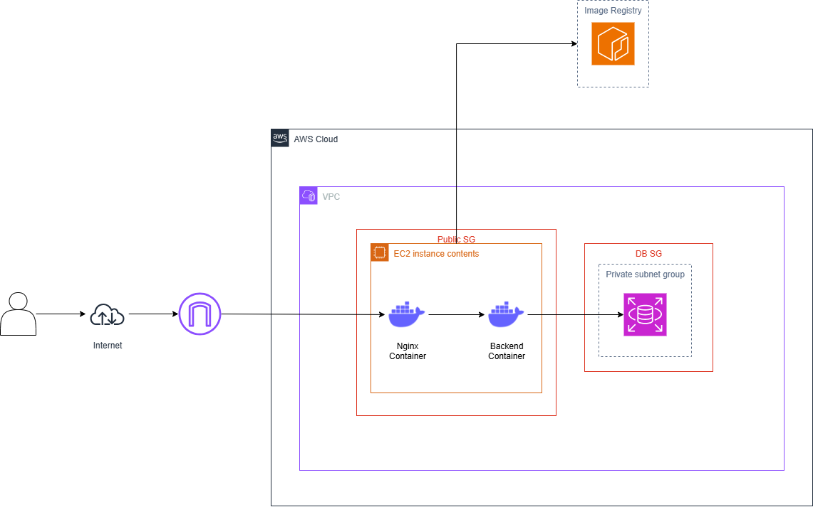

# Workshop: Triển khai Ứng dụng Spring Boot trên AWS với Docker

## Giải pháp cho Triển khai Backend API Hiệu quả

---

# Executive Summary

Workshop này được thiết kế để hướng dẫn các lập trình viên container hóa một ứng dụng Spring Boot bất kỳ bằng Docker, đẩy image lên Amazon Elastic Container Registry (ECR), triển khai trên Amazon EC2, và kết nối với cơ sở dữ liệu Amazon Relational Database Service (RDS) để lưu trữ dữ liệu. Nội dung tập trung vào việc tạo và triển khai Docker image cho backend API, không phải xây dựng một website hoàn chỉnh. Nginx được sử dụng làm reverse proxy để điều phối lưu lượng, đảm bảo truy cập hiệu quả và an toàn. Workshop tận dụng các dịch vụ AWS để cung cấp giải pháp triển khai có khả năng mở rộng, an toàn và tiết kiệm chi phí.

**Tổng quan giải pháp:**

- **Amazon EC2**: Chạy container Docker cho Spring Boot và Nginx.
- **Amazon ECR**: Lưu trữ Docker image an toàn với tính năng quét lỗ hổng.
- **Amazon RDS**: Cung cấp cơ sở dữ liệu MySQL được quản lý với hỗ trợ Multi-AZ.
- **Nginx**: Điều hướng yêu cầu HTTP từ cổng 80 đến ứng dụng Spring Boot trên cổng 8080.
- **Docker Compose**: Quản lý container và mạng trên EC2.

**Lợi ích:**

- Giảm 80% thời gian triển khai so với phương pháp truyền thống.
- Tận dụng AWS Free Tier để giảm thiểu chi phí.
- Nâng cao kỹ năng DevOps và triển khai cloud.
- Đảm bảo triển khai backend API an toàn và có khả năng mở rộng.

**Chi phí dự kiến:**

- **Hạ tầng AWS**: Gần như miễn phí trong Free Tier (EC2 `t3.medium`, RDS `db.t3.micro`, ECR).
- **Chuẩn bị workshop**: \~$500 cho thời gian giảng viên và tài liệu.
- **Thời gian**: Workshop kéo dài một ngày với các bài thực hành.

**Kết quả mong đợi:**

- Người tham gia tạo và triển khai thành công Docker image.
- Ứng dụng phản hồi dưới 200ms và kết nối ổn định với RDS.
- Người tham gia nắm vững kiến thức thực tế về AWS và Docker.

---

# 1. Problem Statement

## Current Situation

Việc triển khai ứng dụng Spring Boot lên môi trường sản xuất, đặc biệt trên các nền tảng cloud như AWS, vẫn là một thách thức lớn đối với nhiều lập trình viên. Các phương pháp triển khai truyền thống phức tạp, tốn thời gian và dễ xảy ra lỗi. Container hóa với Docker giúp đơn giản hóa quy trình, nhưng việc tích hợp với các dịch vụ AWS như EC2, ECR và RDS đòi hỏi kiến thức chuyên sâu mà nhiều lập trình viên còn thiếu.

## Key Challenges

- **Quy trình triển khai phức tạp**: Cấu hình server thủ công mất nhiều thời gian và dễ dẫn đến lỗi.
- **Thiếu kinh nghiệm về AWS**: Lập trình viên thường chưa quen với việc sử dụng EC2, ECR và RDS để triển khai ứng dụng container hóa.
- **Tích hợp cơ sở dữ liệu**: Đảm bảo ứng dụng kết nối an toàn và đáng tin cậy với cơ sở dữ liệu cloud là một thách thức.
- **Bảo mật và mở rộng**: Thiếu kiến thức về cấu hình bảo mật và khả năng mở rộng trên AWS.

## Stakeholder Impact

- **Lập trình viên**: Cần hướng dẫn chi tiết để triển khai ứng dụng nhanh chóng và hiệu quả.
- **Kỹ sư DevOps**: Yêu cầu kiến thức về quản lý hạ tầng AWS và container.
- **Doanh nghiệp**: Mong muốn các giải pháp tiết kiệm chi phí, có khả năng mở rộng để tăng sức cạnh tranh.

## Business Consequences

Nếu không thành thạo triển khai trên cloud:

- Ứng dụng tiếp tục chạy trên hạ tầng on-premises, tốn chi phí (\~$50K/năm) và khó mở rộng.
- Lập trình viên mất thời gian vào các quy trình thủ công, giảm năng suất.
- Doanh nghiệp bỏ lỡ xu hướng cloud-first, với 85% doanh nghiệp áp dụng vào năm 2025 (Gartner 2024).

## Market Opportunity

Theo Gartner 2024, thị trường điện toán đám mây dự kiến đạt 1.2 nghìn tỷ USD vào năm 2027. Việc thành thạo triển khai ứng dụng Spring Boot trên AWS với Docker giúp lập trình viên đáp ứng nhu cầu ngày càng tăng về các giải pháp container hóa và cloud-native, nâng cao khả năng cạnh tranh và giảm chi phí vận hành.

---

# 2. Solution Architecture

## Architecture Overview

Workshop hướng dẫn triển khai ứng dụng Spring Boot theo kiến trúc sau:

- **Amazon EC2**: Chạy container Spring Boot và Nginx thông qua Docker Compose.
- **Amazon ECR**: Lưu trữ Docker image của ứng dụng.
- **Amazon RDS**: Cung cấp cơ sở dữ liệu MySQL (`first_cloud_users`).
- **Nginx**: Reverse proxy điều hướng lưu lượng từ cổng 80 đến Spring Boot trên cổng 8080.
- **Docker Compose**: Quản lý container và mạng nội bộ trên EC2.

## AWS Services Used

- **EC2**: Cung cấp tài nguyên tính toán linh hoạt, tận dụng Free Tier.
- **ECR**: Lưu trữ image an toàn, tích hợp quét lỗ hổng bảo mật.
- **RDS**: Cơ sở dữ liệu MySQL được quản lý, hỗ trợ Multi-AZ và mã hóa.
- **VPC**: Đảm bảo mạng an toàn với các subnet công khai và riêng tư.

## Component Design

- **Ứng dụng Spring Boot**: API REST (ví dụ: quản lý người dùng) kết nối với RDS qua JDBC.
- **Nginx**: Nhận yêu cầu HTTP trên cổng 80, chuyển tiếp đến container Spring Boot trên cổng 8080.
- **Docker Compose**: Quản lý container Spring Boot và Nginx trong một mạng nội bộ.
- **RDS**: Cơ sở dữ liệu MySQL với bảng `users`.
- **ECR**: Cung cấp image Spring Boot cho EC2.

## Security Architecture

- **Security Groups**:
  - `ec2-sg`: Mở cổng 80 (Nginx), 8080 (Spring Boot, giới hạn trong sản xuất), 22 (SSH, giới hạn IP).
  - `rds-sg`: Chỉ cho phép kết nối từ `ec2-sg` trên cổng 3306.
- **Private Subnets**: RDS được đặt trong subnet riêng, không truy cập trực tiếp từ internet.
- **IAM Role**: `CustomRWECRRole` giới hạn quyền truy cập ECR.
- **AWS Secrets Manager** (tùy chọn): Lưu trữ mật khẩu RDS an toàn.

## Scalability Design

- **Multi-AZ**: RDS hỗ trợ Multi-AZ, đảm bảo uptime 99.9%.
- **Docker Compose**: Dễ dàng thêm container Spring Boot để cân bằng tải.
- **EC2 Auto Scaling** (tương lai): Mở rộng instance theo nhu cầu lưu lượng.

- **Internet Gateway** -&gt; **EC2 (Nginx:80, Spring Boot:8080)** -&gt; **RDS (MySQL:3306)**.
- **ECR**: Cung cấp image cho EC2.
- **Docker Network**: Kết nối Nginx và Spring Boot.

---

# 3. Technical Implementation

## Implementation Phases

Workshop được chia thành các mô-đun thực hành trong một ngày:

1. **Chuẩn bị hạ tầng**:

   - Tạo VPC, Security Groups, IAM Role, và DB Subnet Group.
   - Cài đặt AWS CLI và Docker trên máy cục bộ.

2. **Tạo và đẩy image lên ECR**:

   - Tạo repository ECR.
   - Build và đẩy Docker image từ dự án Spring Boot.

3. **Tạo EC2 và RDS**:

   - Khởi chạy instance EC2 (`t3.medium`).
   - Tạo instance RDS (`db.t3.micro`) với database `first_cloud_users`.

4. **Triển khai ứng dụng**:

   - Cài Docker, Nginx, và MySQL Client trên EC2.
   - Chạy Docker Compose để triển khai container.
   - Cấu hình kết nối RDS.

5. **Kiểm tra và xử lý sự cố**:

   - Xác minh API qua trình duyệt/Postman.
   - Giám sát log và xử lý lỗi.

## Technical Requirements

- **Tính toán**: EC2 `t3.medium` (2 vCPU, 4 GB RAM).
- **Lưu trữ**: RDS 20 GB, General Purpose SSD.
- **Mạng**: VPC với 2 subnet công khai (EC2), 2 subnet riêng (RDS).
- **Phần mềm**: Docker, Docker Compose, Nginx, MySQL Client, AWS CLI.

## Development Approach

- **Phương pháp**: Hướng dẫn từng bước với các bài tập thực hành.
- **Công cụ**: AWS Management Console, Docker, Spring Initializr, MobaXterm.

## Testing Strategy

- **Unit Tests**: Sử dụng JUnit để kiểm tra logic API Spring Boot.
- **Integration Tests**: Kiểm tra kết nối RDS bằng MySQL Client.
- **Performance Tests**: Sử dụng Postman để kiểm tra API, mục tiêu thời gian phản hồi &lt; 200ms.
- **Security Tests**: Xác minh Security Group rules và quét lỗ hổng trên ECR.

## Deployment Plan

1. Cài đặt Docker, Nginx, và MySQL Client trên EC2.
2. Tạo file `docker-compose.yml` và `nginx.conf`.
3. Đăng nhập ECR, kéo image, và chạy Docker Compose.
4. Kiểm tra API qua `http://<EC2-Public-IP>/api/<endpoint>`.

## Rollback Procedures

- Nếu triển khai thất bại:
  - Dừng container: `docker compose down`.
  - Kéo image cũ từ ECR: `docker pull <image>:previous-tag`.
  - Chạy lại Docker Compose: `docker compose up -d`.

---

# 4. Timeline & Milestones

## Project Timeline

- **Thời gian**: 1 ngày 
- **Buổi sáng**:
  - Giới thiệu và chuẩn bị hạ tầng 
  - Tạo và đẩy image lên ECR
  - Tạo EC2 và RDS 
- **Buổi chiều**:
  - Triển khai ứng dụng với Docker Compose 
  - Kiểm tra và xử lý sự cố 
  - Tổng kết và Q&A 

## Key Milestones

1. VPC, Security Groups, và IAM Role được cấu hình .
2. Docker image được đẩy lên ECR 
3. EC2 và RDS sẵn sàng 
4. Ứng dụng chạy trên EC2, API truy cập được 
5. Kết nối RDS và API được kiểm tra thành công 

## Dependencies

- Tài khoản AWS và cặp khóa SSH được chuẩn bị trước.
- Repository ECR phải được tạo trước khi đẩy image.
- RDS phải sẵn sàng trước khi triển khai container.
- Security Groups phải được cấu hình đúng.

## Buffer Time

- 30 phút dự phòng cho các vấn đề như lỗi kết nối hoặc cấu hình sai.

---

# 5. Budget Estimation

## Infrastructure Costs

- **EC2 (**`t3.medium`**)**: $0.0416/giờ x 24 giờ x 30 ngày = $29.95/tháng (Free Tier: 750 giờ/tháng).
- **RDS (**`db.t3.micro`**)**: $0.017/giờ x 24 giờ x 30 ngày = $12.24/tháng (Free Tier: 750 giờ/tháng).
- **ECR**: Miễn phí trong Free Tier (500 MB/tháng).
- **Tổng**: \~$42.19/tháng, nhưng gần như miễn phí trong Free Tier cho workshop.

## Operational Costs

- Quản lý và hỗ trợ: Không đáng kể trong Free Tier.

## ROI Analysis

- **Lợi ích**:
  - Giảm 80% thời gian triển khai (4 giờ so với 20 giờ).
  - Tiết kiệm \~64% chi phí so với on-premises ($18K/năm so với $50K/năm).
  - Nâng cao kỹ năng DevOps, tăng khả năng cạnh tranh.
- **Hoàn vốn**: Kỹ năng học được giúp tiết kiệm chi phí triển khai trong các dự án thực tế.

---

# 6. Risk Assessment

## Risk Matrix

| **Rủi ro** | **Tác động** | **Xác suất** | **Giảm thiểu** |
| --- | --- | --- | --- |
| RDS không kết nối | Cao | Thấp | Kiểm tra Security Group, VPC, endpoint RDS |
| Image ECR lỗi | Trung bình | Thấp | Bật scan on push, kiểm tra image cục bộ |
| Lỗi cấu hình EC2 | Trung bình | Trung bình | Cung cấp hướng dẫn chi tiết, hỗ trợ trực tiếp |
| Thiếu thời gian | Trung bình | Trung bình | Lịch trình linh hoạt, tài liệu bổ sung |

## Mitigation Strategies

- **RDS không kết nối**: Kiểm tra Security Group rules, đảm bảo EC2 và RDS trong cùng VPC.
- **Image ECR lỗi**: Bật scan on push, kiểm tra image cục bộ trước khi đẩy.
- **Lỗi cấu hình EC2**: Hướng dẫn từng bước, cung cấp script cài đặt.
- **Thiếu thời gian**: Cung cấp tài liệu tự học và video hướng dẫn.

## Contingency Plans

- **RDS**: Sử dụng snapshot để khôi phục database.
- **ECR**: Giữ image backup với tag `:previous`.
- **EC2**: Khởi động instance mới từ AMI backup.
- **Thời gian**: Tài liệu bổ sung cho các chủ đề nâng cao.

---

# 7. Expected Outcomes

## Success Metrics

- Người tham gia tạo và triển khai thành công Docker image từ dự án Spring Boot.
- Image được đẩy lên ECR và chạy trên EC2.
- Ứng dụng kết nối ổn định với RDS, API phản hồi dưới 200ms.
- Hiểu các phương pháp bảo mật cơ bản (Security Groups, IAM).

## Business Benefits

- **Ngắn hạn (0-6 tháng)**: Triển khai nhanh, giảm lỗi cấu hình.
- **Trung hạn (6-18 tháng)**: Tiết kiệm chi phí, hỗ trợ mở rộng với Auto Scaling.
- **Dài hạn (18+ tháng)**: Tăng khả năng cạnh tranh với chiến lược cloud-first.

## Technical Improvements

- Thành thạo container hóa với Docker và Docker Compose.
- Hiểu cách sử dụng EC2, ECR, RDS để triển khai backend API.
- Áp dụng các phương pháp bảo mật và tối ưu hóa chi phí.

## Long-term Value

- Người tham gia áp dụng kỹ năng vào các dự án thực tế.
- Doanh nghiệp hưởng lợi từ triển khai nhanh, chi phí thấp, và hệ thống đáng tin cậy.

---

# Appendices

## A. Technical Specifications

- **EC2**: `t3.medium`, Ubuntu 24.04.
- **RDS**: MySQL 8.0, `db.t3.micro`, 20 GB SSD.
- **ECR**: Repository `spring-boot-app`, Mutable, Scan on push.
- **Nginx**: Reverse proxy, cổng 80.
- **Spring Boot**: Phiên bản 3.x, Java 18+.
- **Docker**: Phiên bản mới nhất.

## B. Cost Calculations

- **EC2**: $29.95/tháng (Free Tier: 750 giờ).
- **RDS**: $12.24/tháng (Free Tier: 750 giờ).
- **ECR**: Miễn phí trong Free Tier (500 MB).
- **Chuẩn bị workshop**: $500 (one-time).

## C. Architecture Diagrams

## D. References

- AWS Documentation: EC2, RDS, ECR.
- Spring Boot Documentation.
- Docker Documentation.
- Gartner 2024 Cloud Report.